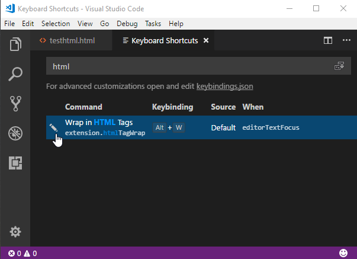

# htmltagwrap
This VS Code extension wraps your text selection in HTML tags.  It can wrap inline selections and selections that span multiple lines (works with both single selections and multiple selections at once).

To use, select one or many chunks of code and press **"Alt + W" ("Option + W" for Mac).**


[Download for Visual Studio Code](https://marketplace.visualstudio.com/items/bradgashler.htmltagwrap)
or
[other editors (via Open VSX)](https://open-vsx.org/extension/bradgashler/htmltagwrap)

## How to Use It
* Select one or more blocks of text or strings of text.
* Press <kbd>Alt</kbd> + <kbd>W</kbd> or <kbd>Option</kbd> + <kbd>W</kbd> for Mac.
* Type the tag name you want.

By default, pressing spacebar will deselect the closing tags, so you can add attributes to the opening tags (you can turn this feature off, see below). If nothing is selected when you run htmltagwrap, it will add an opening and closing tag at the cursor position.

NOTE: This extension works best in files that either use tabs or spaces for indentation.  It may not work as well with mixed tabs/spaces.

## Settings
You can change the default behavior of htmltagwrap with the following settings.

To open VS Code settings, click the "gear" icon  > then "Settings"

### Available settings
* `htmltagwrap.tag` -  The default HTML tag to insert.
* `htmltagwrap.autoDeselectClosingTag` -  Automatically deselect the closing tag after inserting a space.

### Defaults
 ```
 {
    "htmltagwrap.tag": "p",
    "htmltagwrap.autoDeselectClosingTag": true
 }
 ```

### Keyboard shortcut
If **htmltagwrap**'s keyboard shortcut conflicts with another command (i.e. `toggleFindWholeWord` on Windows/Linux or a command from another extension), here are 2 ways to resolve it...


#### 1) Change htmltagwrap's keyboard shortcut

* Click on the gear icon on the bottom-left of VS Code and then on "Keyboard Shortcuts" (or find "Keyboard Shortcuts" from the command palette).
* In the "Search Keybindings" text field, type "htmltagwrap" to see its current keybinding assignment.
* Click on the pencil icon to edit this assignment.
* Type whatever key or key combination you want (e.g. the `F7` key)

*OR...*

#### 2) Change the other keyboard shortcut(s)

Do the same as above, except in the "Search Keybindings" text field copy and paste in `Alt+W` (Windows, Linux) or `⌥ w` (Mac) to find all the commands that conflict and make changes to their assignments.

*See VS Code's [Keybindings](https://code.visualstudio.com/docs/getstarted/keybindings) doc for more info.*

## Known Issues
When using the default setting `"htmltagwrap.autoDeselectClosingTag": true`:
* If you undo and then redo wrapping, entering a space will not remove the selection on the closing tag as it normally would.
* After wrapping, if you press space (removes the closing tag cursor) and then backspace to the tag element name, you won't get your closing tag cursor back.

I haven't found good solutions to these issues using the current extension API.

## Contributing
Please create an issue on GitHub if you experience a bug.
I also welcome pull requests.
